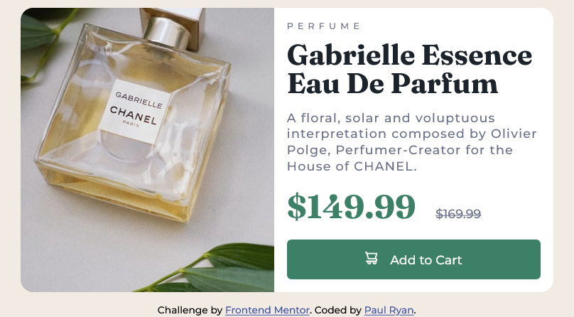

# Frontend Mentor - Product preview card component solution

This is a solution to the [Product preview card component challenge on Frontend Mentor](https://www.frontendmentor.io/challenges/product-preview-card-component-GO7UmttRfa). Frontend Mentor challenges help you improve your coding skills by building realistic projects.

## Table of contents

- [Overview](#overview)
  - [The challenge](#the-challenge)
  - [Screenshot](#screenshot)
  - [Links](#links)
- [My process](#my-process)
  - [Built with](#built-with)
  - [What I learned](#what-i-learned)
  - [Continued development](#continued-development)
  - [Useful resources](#useful-resources)
- [Author](#author)

## Overview

Exercise to build out the product preview card component and get it looking as close to the design as possible.

### The challenge

Users should be able to:

- View the optimal layout depending on their device's screen size
- See hover and focus states for interactive elements

### Screenshot



### Links

- Solution URL: [Add solution URL here](https://github.com/Gunner40/Product-preview-card-component)
- Live Site URL: [Add live site URL here](https://gunner40.github.io/Product-preview-card-component/)

## My process

Started by planning out the HTML and class names using BEM. Then coded the CSS using css variables. No JS needed for this project.

### Built with

- Semantic HTML5 markup
- Flexbox
- Mobile-first workflow

### What I learned

Got more practice at planning out HTML and naming CSS classes using BEM.

Also using display: block on an image will get rid of the small empty space that exists underneath. This space is caused by the image being display: inline by default.

In HTML, to use different image sources, use the picture element and specify different srcset attributes depending on screen size. Always include an img tag as this will be used if no suitable srcset attribute is found. When styling this picture element in css, apply the styles to the img tag (give it a class), and these styles will apply to whichever image the browser uses.

```html
<picture>
  <source
    srcset="./images/image-product-desktop.jpg"
    media="(min-width: 600px)"
  />
  
</picture>
```

```css
.card-image__image {
  width: 100%;
  display: block; /* gets rid of whitespace under image */
  border-radius: 1em 1em 0 0;
}
```

### Continued development

Keep focusing on flexbox and BEM naming convention going forward until i master them. Also keep in mind the importance of planning my approach before beginning to type code.

### Useful resources

[](https://www.w3schools.com/css/css3_object-fit.asp)

## Author

- Name - Paul Ryan
- Frontend Mentor - [@Gunner40](https://www.frontendmentor.io/profile/Gunner40)
